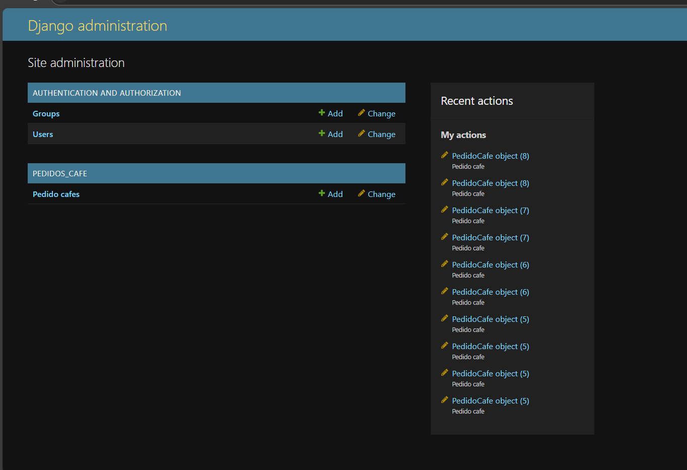
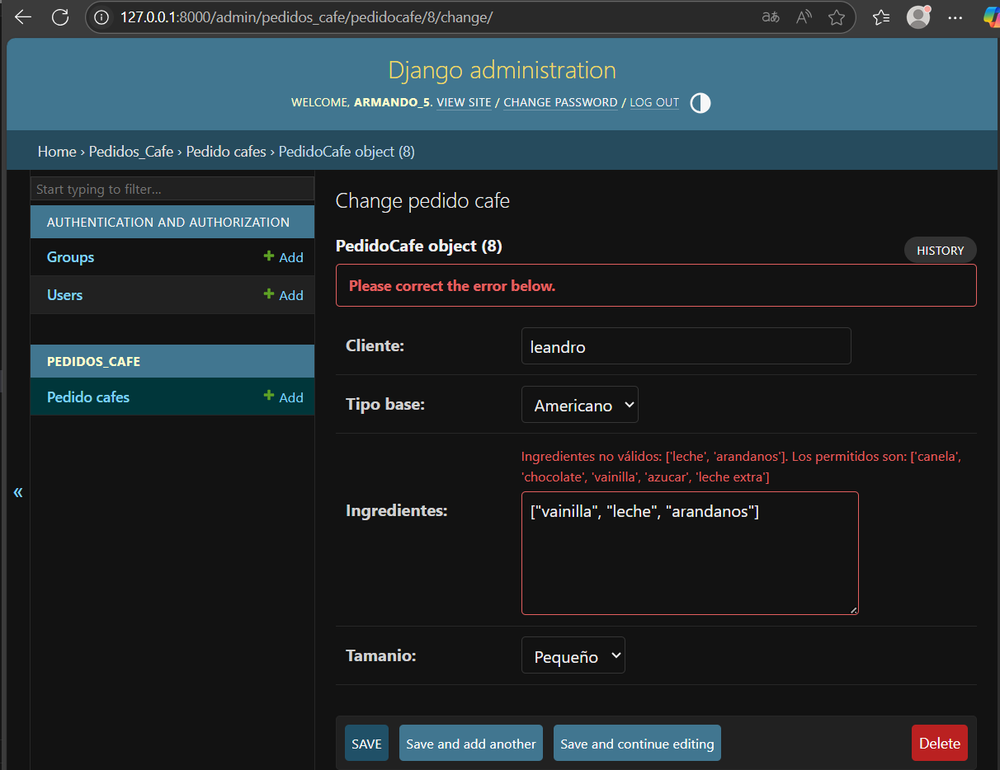
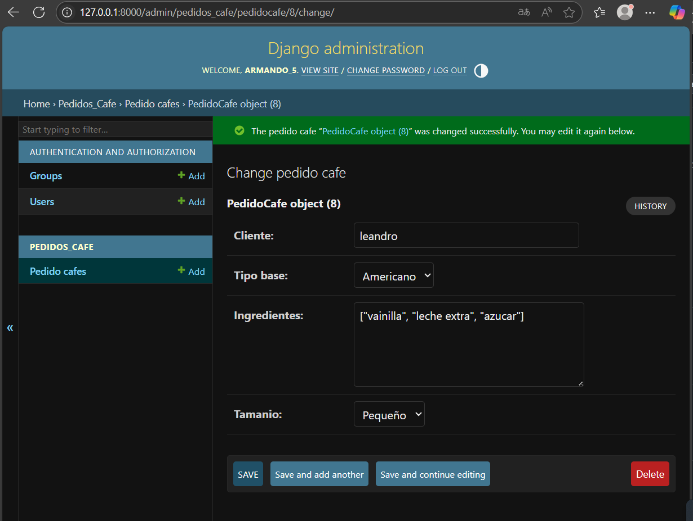
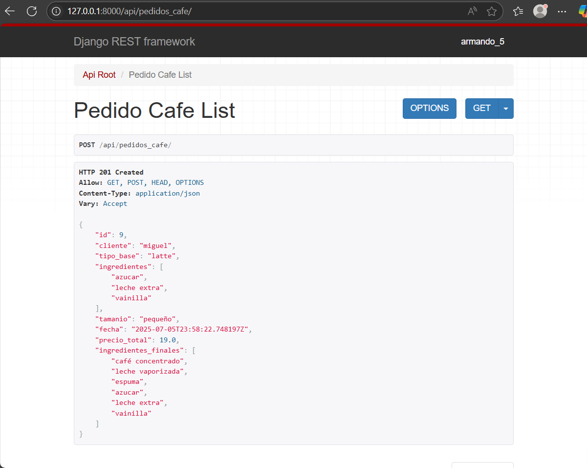

# PRÁCTICA 5

# Patrones de diseño en componentes propios

Repositorio de ejemplo para el uso de Patrones de diseño

## El Patrón Singleton (Instancia Única)
 El Patrón Singleton se utilizó para garantizar que la clase Logger tenga una y solo una instancia disponible en toda la aplicación. Esto es crucial para establecer un punto centralizado desde donde se pueden registrar mensajes y operaciones. Es una elección ideal para gestionar logs y otros recursos que deben ser compartidos globalmente para mantener la consistencia.

 Este patrón está implementado en el archivo api_patrones/logger.py a través de la clase Logger. La lógica específica que asegura la existencia de una única instancia se encuentra dentro del método especial __new__ de esta clase.

 El uso del Singleton se manifiesta claramente en pedidos_cafe/serializers.py. Cada vez que se necesita registrar una operación, como el cálculo de un precio, se invoca Logger().registrar(...). Esto confirma que, en cada llamada, se está accediendo a la misma y única instancia del Logger para almacenar todos los mensajes.

## El Patrón Factory (Fábrica)
 El Patrón Factory actúa como una "fábrica centralizada" para la creación de los distintos tipos de café base, como el Espresso, Americano o Latte. Su propósito principal es desacoplar la forma en que se solicitan estos objetos de la lógica detallada de su creación. Al usar este patrón, el código que necesita un café no tiene que preocuparse por los pormenores de cómo se instancia cada tipo específico. Esto es increíblemente útil porque facilita la adición de nuevas variedades de café en el futuro sin tener que modificar el código existente que ya los utiliza. Es decir, se logra una mayor flexibilidad y un mantenimiento más sencillo.

 La implementación de este patrón reside en el archivo pedidos_cafe/factory.py. Aquí encontrarás la clase CafeFactory y su método estático obtener_base(tipo), que es el encargado de producir la instancia de café correcta. Las definiciones de las clases de café individuales (Espresso, Americano, Latte) están ubicadas en pedidos_cafe/base.py.

 Puedes ver el Patrón Factory en acción en el archivo pedidos_cafe/serializers.py. Observa la línea cafe = CafeFactory.obtener_base(obj.tipo_base). Esta instrucción es la que invoca la fábrica para obtener la instancia de café base adecuada, basándose en el tipo de pedido especificado.

## El Patrón Builder (Constructor)
 El Patrón Builder se empleó para construir objetos PedidoCafe de manera compleja y paso a paso. Imagina que quieres armar un café personalizado, añadiendo ingredientes específicos o ajustando el tamaño; el Builder te permite hacer esto de forma incremental. La ventaja clave es que separa la forma en que se construye un café de su representación final. Esto resulta invaluable para crear pedidos altamente personalizados o para definir "paquetes" de café preconfigurados.

 La implementación de este patrón se encuentra en el archivo pedidos_cafe/builder.py. Aquí se definen las clases CafePersonalizadoBuilder (que es el constructor en sí) y CafeDirector (el director que coordina los pasos de construcción).

 Su uso es evidente en el archivo pedidos_cafe/serializers.py, específicamente dentro del método auxiliar _build_cafe_and_get_builder. Este método ilustra cómo el Director utiliza las etapas definidas en el Builder para ensamblar el café personalizado, calculando su precio final y los ingredientes incorporados.

## Pasos para la práctica

## 1.-Configurar e instalar dependencias en el entorno virtual de python.
* Crear entorno virtual

```bash
python -m venv venv
```
* Crear un archivo 
```bash
.gitignore
```
* Activar entorno virtual

```bash
# Windows
.\env\Scripts\activate

# Linux
source env/bin/activate
```
* Problemas de activacion 

    Windows PowerShel
```bash
Set-ExecutionPolicy Unrestricted
```
* crear un archivo "requirements.txt" 
```bash
requirements.txt 
```
* agregar en requirements.txt 
```bash
Django==5.2
django-extensions==4.1
djangorestframework==3.16.0
```
* instalar dependencias

```bash
pip install -r requirements.txt 
```
```bash
pip install django == 5.2
pip install django-extensions == 4.1
pip install djangorestframework == 3.16.0
pip install pydotplus
```

## 2.-Crear un proyecto Django y una aplicación
```bash
django-admin startproject api_patrones .
```
```bash
python manage.py startapp pedidos_cafe
```
## 3.-Configurar la base de datos en settings.py para usar SQLite.

```bash
INSTALLED_APPS = [
    ...
    'django_extensions',
    'rest_framework',
    'pedidos_cafe',
]
```

## 4.-Crear el modelo en pedidos_cafe/models.py.

```bash
from jango.db import models
from django.core.exceptions import ValidationError
from pedidos_cafe.factory import CafeFactory
from pedidos_cafe.builder import CafePersonalizadoBuilder
# Create your models here.

class PedidoCafe(models.Model):
    cliente = models.CharField(max_length=100)
    tipo_base = models.CharField(
        max_length=20,
        choices=[
            ("espresso", "Espresso"),
            ("americano", "Americano"),
            ("latte", "Latte"),
        ],
    )
    ingredientes = models.JSONField(default=list)
    tamanio = models.CharField(
        max_length=10,
        choices=[
            ("pequeño", "Pequeño"),
            ("mediano", "Mediano"),
            ("grande", "Grande"),
        ],
    )
    fecha = models.DateTimeField(auto_now_add=True)

```
## 5.-Crear la base en pedidos_cafe/base.py.

```bash
class CafeBase:
    def __init__(self):
        self.ingredientes = []
        self.precio = 0

    def inicializar(self):
        """Define los ingredientes y el precio base. Implementado por subclases."""
        raise NotImplementedError()

    def obtener_ingredientes_base(self):
        return self.ingredientes

    def precio_base(self):
        return self.precio


class Espresso(CafeBase):
    def inicializar(self):
        self.ingredientes = ["café concentrado"]
        self.precio = 10


class Americano(CafeBase):
    def inicializar(self):
        self.ingredientes = ["café filtrado", "agua caliente"]
        self.precio = 12


class Latte(CafeBase):
    def inicializar(self):
        self.ingredientes = ["café concentrado", "leche vaporizada", "espuma"]
        self.precio = 15
```
## 6.-Crear el builder en pedidos_cafe/builder.py.

```bash
class CafePersonalizadoBuilder:
    def __init__(self, cafe_base):
        self.base = cafe_base
        self.precio = cafe_base.precio_base()
        self.ingredientes = list(cafe_base.obtener_ingredientes_base())

    def agregar_ingrediente(self, ingrediente):
        precios = {
            "canela": 1,
            "chocolate": 2,
            "vainilla": 1.5,
            "azucar": 0.5,
            "leche extra": 2,
        }
        if ingrediente not in precios:
            raise ValueError(f"Ingrediente '{ingrediente}' no válido o no disponible.")
        self.ingredientes.append(ingrediente)
        self.precio += precios.get(ingrediente, 0)

    def ajustar_tamanio(self, tamaño):
        if tamaño == "mediano":
            self.precio *= 1.25
        elif tamaño == "grande":
            self.precio *= 1.5

    def obtener_precio(self):
        return round(self.precio, 2)

    def obtener_ingredientes_finales(self):
        return self.ingredientes


class CafeDirector:
    def __init__(self, builder):
        self.builder = builder

    def construir(self, ingredientes, tamaño):
        for i in ingredientes:
            self.builder.agregar_ingrediente(i)
        self.builder.ajustar_tamanio(tamaño)

    def construir_paquete_1(self):
        self.builder.agregar_ingrediente("canela")
        self.builder.agregar_ingrediente("chocolate")
        self.builder.ajustar_tamanio("mediano")

    def construir_paquete_2(self):
        self.builder.agregar_ingrediente("vainilla")
        self.builder.agregar_ingrediente("azucar")
        self.builder.ajustar_tamanio("grande")

    def construir_paquete_3(self):
        self.builder.agregar_ingrediente("leche extra")
        self.builder.agregar_ingrediente("canela")
        self.builder.ajustar_tamanio("pequeño")
```

## 7.-Crear el factory en pedidos_cafe/basefactory.py.

```bash
from pedidos_cafe.base import Espresso, Americano, Latte

class CafeFactory:
    @staticmethod
    def obtener_base(tipo):
        if tipo == "espresso":
            cafe = Espresso()
        elif tipo == "americano":
            cafe = Americano()
        elif tipo == "latte":
            cafe = Latte()
        else:
            raise ValueError("Tipo de café no válido")

        cafe.inicializar()
        return cafe
```

## 8.-Crear el serializer en pedidos_cafe/serializers.py.

```bash
from rest_framework import serializers
from pedidos_cafe.models import PedidoCafe
from pedidos_cafe.factory import CafeFactory
from pedidos_cafe.builder import CafePersonalizadoBuilder, CafeDirector
from api_patrones.logger import Logger


class PedidoCafeSerializer(serializers.ModelSerializer):
    precio_total = serializers.SerializerMethodField()
    ingredientes_finales = serializers.SerializerMethodField()

    class Meta:
        model = PedidoCafe
        fields = [
            "id",
            "cliente",
            "tipo_base",
            "ingredientes",
            "tamanio",
            "fecha",
            "precio_total",
            "ingredientes_finales",
        ]

    def get_precio_total(self, obj):
        # Patron Factory
        cafe = CafeFactory.obtener_base(obj.tipo_base)
        # Patron Builder
        builder = CafePersonalizadoBuilder(cafe)
        director = CafeDirector(builder)
        director.construir(obj.ingredientes, obj.tamanio)
        # Patron Singleton
        Logger().registrar(f"Se registró el calculo del precio para el pedido {obj.id}")
        print(Logger().obtener_logs())
        return builder.obtener_precio()

    def get_ingredientes_finales(self, obj):
        # Patron Factory
        cafe = CafeFactory.obtener_base(obj.tipo_base)
        # Patron Builder
        builder = CafePersonalizadoBuilder(cafe)
        director = CafeDirector(builder)
        director.construir(obj.ingredientes, obj.tamanio)
        # Patron Singleton
        Logger().registrar(
            f"Se registró la obtención de ingredientes finales para el pedido {obj.id}"
        )
        print(Logger().obtener_logs())
        return builder.obtener_ingredientes_finales()
```
## 9.-Crear las vistas en pedidos_cafe/views.py.

```bash
from django.shortcuts import render

# Create your views here.

# Python native imports
from datetime import timedelta

# External imports
from rest_framework import viewsets
from django.utils import timezone as tz

# Local imports
from pedidos_cafe.serializers import *
from pedidos_cafe.models import *
from django.conf import settings


class PedidoCafeViewSet(viewsets.ModelViewSet):
    queryset = PedidoCafe.objects.all().order_by("-fecha")
    serializer_class = PedidoCafeSerializer
```

## 10.-Configurar las URLs en pedidos_cafe/urls.py.

```bash
# Django imports
from django.contrib import admin
from django.urls import path, include

# Rest framework imports
from rest_framework import routers

# Local imports
from pedidos_cafe.views import PedidoCafeViewSet

# Create a router and register our viewset with it.
router = routers.DefaultRouter()

router.register(r"pedidos_cafe", PedidoCafeViewSet, basename="pedidos_cafe")


urlpatterns = [
    path("admin/", admin.site.urls),
    path("api/", include(router.urls)),
]
```
## 11.-Crear el logger en api_patrones/logger.py.
```bash
class Logger:
    _instancia = None

    def __new__(cls):
        if cls._instancia is None:
            cls._instancia = super().__new__(cls)
            cls._instancia.logs = []
        return cls._instancia

    def registrar(self, mensaje):
        self.logs.append(mensaje)

    def obtener_logs(self):
        return self.logs
```
## 12.-Hacer la validación ingredientes extra en el registro de pedidos

* Para validar la api en pedidos_cafe/serializers.py agregar.
```bash
 def validate_ingredientes(self, value):
        # Crear un builder temporal con cualquier base
        cafe_dummy = CafeFactory.obtener_base("espresso")
        builder = CafePersonalizadoBuilder(cafe_dummy)

        # Obtenemos la lista de ingredientes válidos desde el builder
        precios_validos = {
            "canela": 1,
            "chocolate": 2,
            "vainilla": 1.5,
            "azucar": 0.5,
            "leche extra": 2,
        }

        ingredientes_invalidos = [
            ingrediente for ingrediente in value if ingrediente not in precios_validos
        ]

        if ingredientes_invalidos:
            raise serializers.ValidationError(
                f"Ingredientes no válidos: {ingredientes_invalidos}. "
                f"Los permitidos son: {list(precios_validos.keys())}"
            )

        return value
```
* Para validar el administrador en pedidos_cafe/models.py agregar.
```bash
def clean(self):

        cafe = CafeFactory.obtener_base("espresso")
        builder = CafePersonalizadoBuilder(cafe)

        ingredientes_invalidos = []

        for ingrediente in self.ingredientes:
            try:
                builder.agregar_ingrediente(ingrediente)
            except ValueError:
                ingredientes_invalidos.append(ingrediente)

        if ingredientes_invalidos:
            raise ValidationError({
                'ingredientes': (
                    f"Ingredientes no válidos: {ingredientes_invalidos}. "
                    f"Los permitidos son: ['canela', 'chocolate', 'vainilla', 'azucar', 'leche extra']"
                )
            })
```
## 13.-Configurar el admin en pedidos_cafe/admin.py. 

* Escribe el siguiente código

```python
from django.contrib import admin
from pedidos_cafe.models import PedidoCafe

admin.site.register(PedidoCafe)
```

## 14.-Crear migraciones

```bash
python manage.py makemigrations
```
```bash
python manage.py migrate
```

## 15.-Crear superusuario

```bash
python manage.py createsuperuser
```


## 16.-Iniciar servidor

```bash
python manage.py runserver
```

## Acceder al panel de administración

Abre tu navegador y ve a `http://localhost:8000/`. 

Inicia sesión con el superusuario que creaste anteriormente.`http://localhost:8000/admin/`.Deberías ver la opcion para agregar
pedido cafe.





Para ingresar a la api.`http://localhost:8000/api/`.




